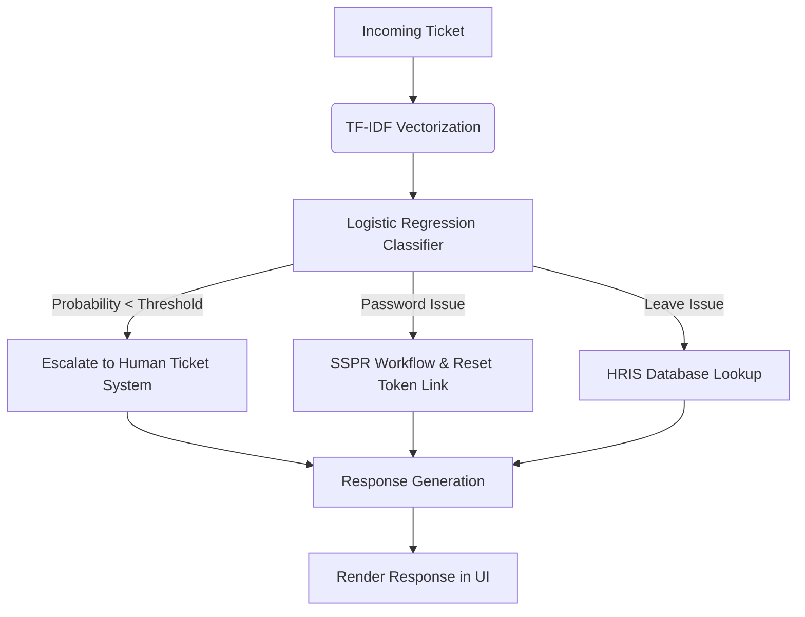

# 🎫 Ticket AI Categorization & Resolution System

A lightweight, self-contained machine learning classifier and automated workflow router for internal IT and HR support tickets. It groups user inquiries, queries mock databases, runs backend workflows, and generates natural language responses.

---

## 🏛️ Architecture & Workflow



1. **Preprocessing & Feature Extraction**: The incoming text query is cleaned and converted to a TF-IDF matrix.
2. **Intent Classification**: A Logistic Regression classifier classifies the query into one of three intents: `Password Issue`, `Leave Issue`, or `Human Escalation`.
3. **Decision & Routing Engine**: If confidence drops below a customizable threshold, the system automatically redirects the inquiry to `Human Escalation` to prevent incorrect automated actions.
4. **Action Resolution**:
   - For **Password Issues**: The system generates a simulated secure token and a recovery link.
   - For **Leave Issues**: The system queries a mock HRIS database using the active employee's identity.
5. **Formulated Response**: Returns a tailored, Markdown-formatted reply to the user.

---

## 📂 Project Structure

```text
├── app.py          # Streamlit UI dashboard and system orchestration
├── classifier.py   # Machine Learning model training & classification engine
├── actions.py      # Automated workflows, email templates & mock databases
└── README.md       # Project documentation (this file)
```

---

## 🚀 Getting Started

### Prerequisites

Make sure you have Python 3.8+ and the following libraries installed:
```bash
pip install streamlit scikit-learn pandas numpy
```

### Running the Application

To run the interactive Streamlit dashboard:
```bash
streamlit run app.py
```

Once started, the dashboard will open automatically in your default web browser at:
👉 **[http://localhost:8501](http://localhost:8501)**

---

## 🛠️ Simulating Workflows

Inside the Streamlit sidebar, you can configure:
*   **Active Simulated User**: Switch between *Jane Doe*, *Alice Smith*, and *Bob Jones* to fetch corresponding leave balances from the mock HRIS database.
*   **Confidence Threshold**: Adjust the model sensitivity. Any automated prediction lower than the threshold is automatically escalated to a human helper.
